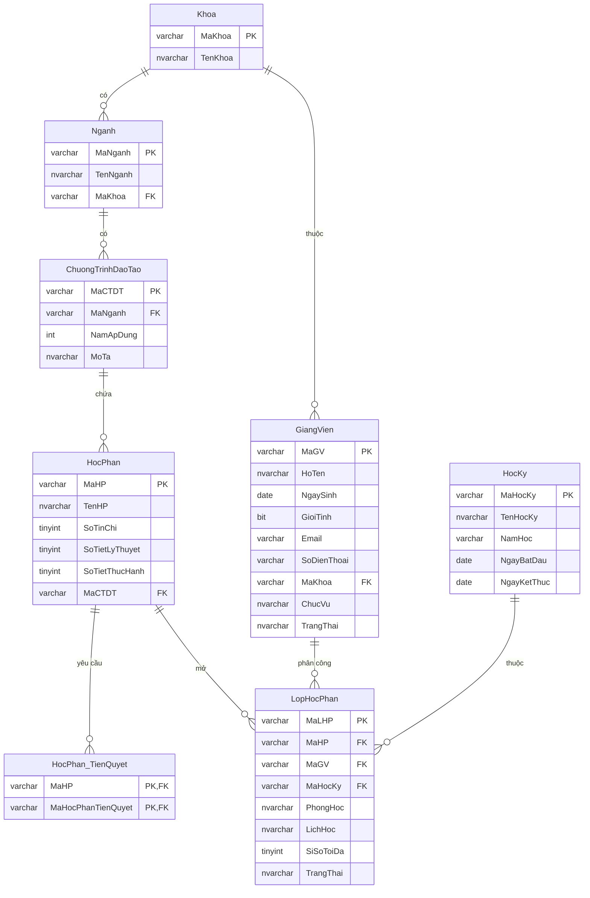

# Thiết kế ERD Học phần, Giảng viên & Mở lớp học phần
## 1. Mục tiêu
Thiết kế ERD (Entity Relationship Diagram) cho module Học phần, Giảng viên và Mở lớp học phần nhằm mô tả cấu trúc dữ liệu, các thực thể và mối quan hệ giữa chúng trong hệ thống quản lý đăng ký tín chỉ. Việc thiết kế ERD giúp xây dựng cơ sở dữ liệu thống nhất, hạn chế dư thừa dữ liệu, đảm bảo tính toàn vẹn và hỗ trợ hiệu quả cho các nghiệp vụ quản lý học phần, phân công giảng viên và mở lớp học phần.

## 2. Phân tích các thực thể
### 2.1 Thực thể CHUONGTRINHDAOTAO
Ý nghĩa
Thực thể CHUONGTRINHDAOTAO lưu thông tin về chương trình đào tạo của từng ngành. Mỗi chương trình đào tạo bao gồm danh sách các học phần mà sinh viên phải hoàn thành trong suốt quá trình học.

Thuộc tính |	Kiểu dữ liệu    |	Ràng buộc |	Ý nghĩa
MaCTDT     | 	varchar(10)	PK, |   NOT NULL  | Mã chương trình đào tạo
MaNganh    | 	varchar(10)	FK, |  NOT NULL	  | Mã ngành
NamApDung  | 	int	            |  NOT NULL	  |Năm áp dụng
MoTa       | 	nvarchar(255)   |  NULL	      |Mô tả chương trình

### 2.2 Thực thể HOCPHAN
Ý nghĩa
Thực thể HOCPHAN lưu danh mục các học phần được giảng dạy trong từng chương trình đào tạo. Đây là thực thể trung tâm của module vì tất cả các lớp học phần đều được mở dựa trên học phần.

Thuộc tính | 	Kiểu dữ liệu  | Ràng buộc    | 	Ý nghĩa
MaHP       | 	varchar(10)   | PK, NOT NULL | 	Mã học phần
TenHP      | 	nvarchar(100) | NOT NULL     | 	Tên học phần
SoTinChi   | 	tinyint       | CHECK (>0)   | 	Số tín chỉ
LyThuyet   | 	tinyint       | NOT NULL     | 	Số tiết lý thuyết
ThucHanh   | 	tinyint       | NOT NULL     | 	Số tiết thực hành
MaCTDT     | 	varchar(10)   |  FK	         |  Chương trình đào tạo

### 2.3 Thực thể HOCPHAN_TIENQUYET
Ý nghĩa
Thực thể HOCPHAN_TIENQUYET quản lý mối quan hệ tiên quyết giữa các học phần. Một học phần có thể yêu cầu nhiều học phần tiên quyết và ngược lại.

Thuộc tính         |	Kiểu dữ liệu |	Ràng buộc |	Ý nghĩa
MaHP               |	varchar(10)  |	PK, FK    |Học phần
MaHocPhanTienQuyet |	varchar(10)  |  PK, FK    |Học phần tiên quyết

### 2.4 Thực thể GIANGVIEN
Ý nghĩa
Thực thể GIANGVIEN lưu trữ thông tin giảng viên phục vụ cho việc phân công giảng dạy các lớp học phần.

Thuộc tính  |	Kiểu dữ liệu |	Ràng buộc    |	Ý nghĩa
MaGV        |	varchar(10)  |  PK, NOT NULL |  Mã giảng viên
HoTen       |	nvarchar(100)|	NOT NULL     |  Họ tên
NgaySinh    |	date         |	NULL	     |  Ngày sinh
GioiTinh    |	bit	         |  NULL	     |  Giới tính
Email       |	varchar(100) |	UNIQUE	     |  Email
SoDienThoai |	varchar(15)  |	NULL	     |  Số điện thoại
MaKhoa      |	nvarchar(100)|	NOT NULL     |  Khoa quản lý
ChucVu      |	nvarchar(50) |	NULL	     |  Chức vụ
TrangThai   |	nvarchar(30)	DEFAULT      |  Trạng thái làm việc

### 2.5 Thực thể HOCKY
Ý nghĩa
Thực thể HOCKY lưu thông tin các học kỳ được sử dụng để tổ chức mở lớp học phần theo từng năm học.

Thuộc tính |	Kiểu dữ liệu |	Ràng buộc  |	Ý nghĩa
MaHocKy    |	varchar(10)	 |  PK	       | Mã học kỳ
TenHocKy   |	nvarchar(30) |  NOT NULL   | Tên học kỳ
NamHoc     |	varchar(9)	 |  NOT NULL   | Năm học
NgayBatDau |	date	     |  NOT NULL   | Ngày bắt đầu
NgayKetThuc|	date	     |  NOT NULL   | Ngày kết thúc

### 2.6 Thực thể LOPHOCPHAN
Ý nghĩa
Thực thể LOPHOCPHAN lưu thông tin các lớp học phần được mở trong từng học kỳ. Mỗi lớp học phần gắn với một học phần, một giảng viên và một học kỳ cụ thể.

Thuộc tính | 	Kiểu dữ liệu |	Ràng buộc |	Ý nghĩa
MaLHP	   |varchar(10)      |	PK	      |Mã lớp học phần
MaHP	   |varchar(10)      |	FK	      |Học phần
MaGV	   |varchar(10)	     |  FK	      |Giảng viên
MaHocKy	   |varchar(10)	     |  FK	      |Học kỳ
PhongHoc   |nvarchar(30)	 |  NOT NULL  |Phòng học
LichHoc	   |nvarchar(100)	 |  NOT NULL  |Lịch học
SiSoToiDa  |tinyint	         |  CHECK (>0)|Sĩ số tối đa
TrangThai  |nvarchar(30)	 |  DEFAULT	  |Trạng thái lớp học phần

## 3. Phân tích mối quan hệ giữa các thực thể
Quan hệ	Kiểu quan hệ	Giải thích
CHUONGTRINHDAOTAO – HOCPHAN	1 – N	Một chương trình đào tạo bao gồm nhiều học phần, mỗi học phần chỉ thuộc một chương trình đào tạo.
HOCPHAN – LOPHOCPHAN	1 – N	Một học phần có thể được mở thành nhiều lớp học phần ở các học kỳ khác nhau, nhưng mỗi lớp học phần chỉ thuộc một học phần.
GIANGVIEN – LOPHOCPHAN	1 – N	Một giảng viên có thể giảng dạy nhiều lớp học phần, nhưng mỗi lớp học phần chỉ do một giảng viên phụ trách.
HOCKY – LOPHOCPHAN	1 – N	Một học kỳ có thể mở nhiều lớp học phần, nhưng mỗi lớp học phần chỉ thuộc một học kỳ.
HOCPHAN – HOCPHAN_TIENQUYET	N – N	Một học phần có thể có nhiều học phần tiên quyết và đồng thời cũng có thể là học phần tiên quyết của nhiều học phần khác. Quan hệ này được cài đặt thông qua bảng trung gian HOCPHAN_TIENQUYET.

### 3.1 Ràng buộc toàn vẹn
####  3.1.1 Ràng buộc thực thể
•	Mỗi bảng phải có khóa chính (Primary Key) duy nhất. 
•	Khóa chính không được để trống (NOT NULL). 
#### 3.1.2 Ràng buộc tham chiếu
•	MaCTDT trong bảng HOCPHAN phải tồn tại trong bảng CHUONGTRINHDAOTAO. 
•	MaHP, MaGV và MaHocKy trong bảng LOPHOCPHAN phải tồn tại trong các bảng tương ứng. 
•	MaHP và MaHocPhanTienQuyet trong bảng HOCPHAN_TIENQUYET phải tham chiếu đến bảng HOCPHAN. 
3.1.3 Ràng buộc miền giá trị
•	Số tín chỉ phải lớn hơn 0. 
•	Số tiết lý thuyết và thực hành không được âm. 
•	Sĩ số tối đa phải lớn hơn 0. 
•	Ngày bắt đầu học kỳ phải nhỏ hơn ngày kết thúc. 
#### 3.1.4 Ràng buộc nghiệp vụ
•	Không được mở lớp học phần khi học phần chưa tồn tại. 
•	Không được phân công một giảng viên giảng dạy hai lớp học phần trùng thời gian. 
•	Không được sử dụng cùng một phòng học cho hai lớp học phần tại cùng một thời điểm. 
•	Không được xóa học phần hoặc giảng viên khi vẫn còn được tham chiếu trong bảng LOPHOCPHAN. 
•	Khi số lượng sinh viên đăng ký đạt sĩ số tối đa, hệ thống sẽ ngừng tiếp nhận đăng ký mới cho lớp học phần
•	Học phần có thể có hoặc không có học phần tiên quyết. Nếu có thì học phần tiên quyết phải tồn tại trong hệ thống.
•	
CHUONGTRINHDAOTAO
        │1
        │
        │N
    HOCPHAN
        │
        ├───────────────┐
        │               │
        │               │
        ▼               ▼
HOCPHAN_TIENQUYET   LOPHOCPHAN
                        ▲
            ┌───────────┴───────────┐
            │                      	│
            │                       │
       GIANGVIEN              	   HOCKY.

/*==========================================================
    DATABASE
==========================================================*/
if db_id('DangKyHocPhan') is not null
begin
    alter database DangKyHocPhan set single_user with rollback immediate;
    drop database DangKyHocPhan;
end

create database DangKyHocPhan;
use DangKyHocPhan;

create table Khoa(
    MaKhoa varchar(10) not null,
    TenKhoa nvarchar(100) not null,
    constraint PK_Khoa primary key(MaKhoa),
    constraint UQ_Khoa unique(TenKhoa)
);

create table Nganh(
    MaNganh varchar(10) not null,
    TenNganh nvarchar(100) not null,
    MaKhoa varchar(10) not null,
    constraint PK_Nganh primary key(MaNganh),
    constraint FK_Nganh_Khoa foreign key(MaKhoa) references Khoa(MaKhoa)
);

create table ChuongTrinhDaoTao(
    MaCTDT varchar(10) not null,
    MaNganh varchar(10) not null,
    NamApDung int not null,
    MoTa nvarchar(255),
    constraint PK_CTDT primary key(MaCTDT),
    constraint FK_CTDT_Nganh foreign key(MaNganh) references Nganh(MaNganh),
    constraint CK_CTDT_Nam check(NamApDung>=2000)
);

create table HocPhan(
    MaHP varchar(10) not null,
    TenHP nvarchar(150) not null,
    SoTinChi tinyint not null,
    SoTietLyThuyet tinyint not null,
    SoTietThucHanh tinyint not null,
    MaCTDT varchar(10) not null,
    constraint PK_HocPhan primary key(MaHP),
    constraint FK_HP_CTDT foreign key(MaCTDT) references ChuongTrinhDaoTao(MaCTDT),
    constraint CK_HP_TinChi check(SoTinChi>0),
    constraint CK_HP_LT check(SoTietLyThuyet>=0),
    constraint CK_HP_TH check(SoTietThucHanh>=0),
    constraint CK_HP_TongTiet check(SoTietLyThuyet+SoTietThucHanh>0),
    constraint UQ_HP unique(TenHP,MaCTDT)
);

create table HocPhan_TienQuyet(
    MaHP varchar(10) not null,
    MaHocPhanTienQuyet varchar(10) not null,
    constraint PK_HP_TQ primary key(MaHP,MaHocPhanTienQuyet),
    constraint FK_HP_TQ_HP foreign key(MaHP) references HocPhan(MaHP),
    constraint FK_HP_TQ_HP2 foreign key(MaHocPhanTienQuyet) references HocPhan(MaHP),
    constraint CK_HP_TQ check(MaHP<>MaHocPhanTienQuyet)
);

create table GiangVien(
    MaGV varchar(10) not null,
    HoTen nvarchar(100) not null,
    NgaySinh date,
    GioiTinh bit,
    Email varchar(100) not null,
    SoDienThoai varchar(15),
    MaKhoa varchar(10) not null,
    ChucVu nvarchar(50),
    TrangThai nvarchar(30) default N'Đang công tác',
    constraint PK_GiangVien primary key(MaGV),
    constraint UQ_GV_Email unique(Email),
    constraint FK_GV_Khoa foreign key(MaKhoa) references Khoa(MaKhoa)
);

create table HocKy(
    MaHocKy varchar(10) not null,
    TenHocKy nvarchar(30) not null,
    NamHoc varchar(9) not null,
    NgayBatDau date not null,
    NgayKetThuc date not null,
    constraint PK_HocKy primary key(MaHocKy),
    constraint UQ_HocKy unique(TenHocKy,NamHoc),
    constraint CK_HocKy_Ngay check(NgayBatDau<NgayKetThuc)
);

create table LopHocPhan(
    MaLHP varchar(10) not null,
    MaHP varchar(10) not null,
    MaGV varchar(10) not null,
    MaHocKy varchar(10) not null,
    PhongHoc nvarchar(30) not null,
    LichHoc nvarchar(100) not null,
    SiSoToiDa tinyint not null,
    TrangThai nvarchar(30) default N'Mở đăng ký',
    constraint PK_LopHocPhan primary key(MaLHP),
    constraint FK_LHP_HP foreign key(MaHP) references HocPhan(MaHP),
    constraint FK_LHP_GV foreign key(MaGV) references GiangVien(MaGV),
    constraint FK_LHP_HK foreign key(MaHocKy) references HocKy(MaHocKy),
    constraint CK_LHP_SiSo check(SiSoToiDa>0)
);

alter table LopHocPhan
add constraint UQ_Phong_Lich unique(PhongHoc,LichHoc,MaHocKy);

alter table LopHocPhan
add constraint UQ_GV_Lich unique(MaGV,LichHoc,MaHocKy);

create index IDX_HP_CTDT on HocPhan(MaCTDT);
create index IDX_LHP_HP on LopHocPhan(MaHP);
create index IDX_LHP_GV on LopHocPhan(MaGV);
create index IDX_LHP_HK on LopHocPhan(MaHocKy);
