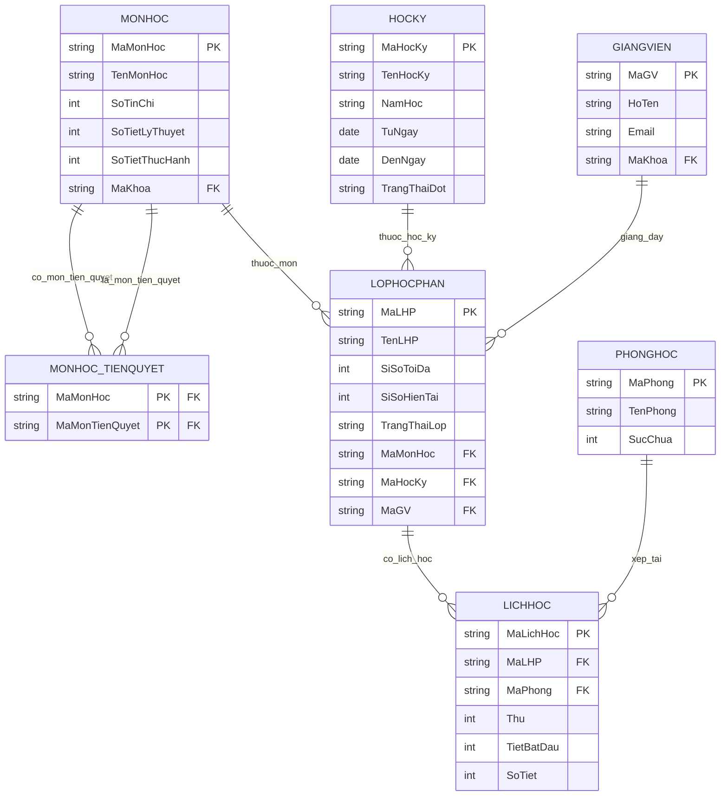

# Thiết kế ERD Học phần, Giảng viên & Mở lớp học phần
## 1. Mục tiêu
Thiết kế ERD (Entity Relationship Diagram) cho module Học phần, Giảng viên và Mở lớp học phần nhằm mô tả cấu trúc dữ liệu, các thực thể và mối quan hệ giữa chúng trong hệ thống quản lý đăng ký tín chỉ. ERD là cơ sở để xây dựng cơ sở dữ liệu phục vụ các nghiệp vụ quản lý học phần, thiết lập học phần tiên quyết, quản lý giảng viên và mở lớp học phần theo từng học kỳ.

Mô hình được thiết kế nhằm đảm bảo dữ liệu được tổ chức khoa học, hạn chế dư thừa, duy trì tính toàn vẹn và nhất quán của dữ liệu, đồng thời hỗ trợ hiệu quả cho việc phân công giảng viên, bố trí lịch học, phòng học và phục vụ quá trình đăng ký học phần của sinh viên.

## 2. Phân tích các thực thể
### 2.1 Thực thể MONHOC
Ý nghĩa
Thực thể MONHOC lưu thông tin các môn học được giảng dạy trong hệ thống. Đây là thực thể trung tâm, là cơ sở để mở các lớp học phần trong từng học kỳ và thiết lập quan hệ môn học tiên quyết.

| Thuộc tính | Kiểu dữ liệu | Ràng buộc | Ý nghĩa |
| :--- | :--- | :--- | :--- |
| MaMonHoc | varchar(10) | PK, NOT NULL | Mã môn học |
| TenMonHoc | nvarchar(100) | NOT NULL | Tên môn học |
| SoTinChi | int | CHECK (>0) | Số tín chỉ |
| SoTietLyThuyet | int | CHECK (>=0) | Số tiết lý thuyết |
| SoTietThucHanh | int | CHECK (>=0) | Số tiết thực hành |
| MaKhoa | varchar(10) | FK | Khoa quản lý môn học |
### 2.2 Thực thể MONHOC_TIENQUYET
Ý nghĩa
Thực thể MONHOC_TIENQUYET quản lý mối quan hệ tiên quyết giữa các môn học. Một môn học có thể yêu cầu một hoặc nhiều môn học tiên quyết trước khi sinh viên được đăng ký học.

| Thuộc tính | Kiểu dữ liệu | Ràng buộc | Ý nghĩa |
| :--- | :--- | :--- | :--- |
| MaMonHoc | varchar(10) | PK, FK | Mã môn học chính |
| MaMonTienQuyet | varchar(10) | PK, FK | Mã môn học tiên quyết bắt buộc |

### 2.3 Thực thể GIANGVIEN
Ý nghĩa

Thực thể GIANGVIEN lưu trữ thông tin giảng viên phục vụ cho việc phân công giảng dạy các lớp học phần.

| Thuộc tính | Kiểu dữ liệu | Ràng buộc | Ý nghĩa |
| :--- | :--- | :--- | :--- |
| MaGV | varchar(10) | PK, NOT NULL | Mã giảng viên |
| HoTen | nvarchar(100) | NOT NULL | Họ tên giảng viên |
| Email | varchar(100) | UNIQUE, NOT NULL | Địa chỉ email |
| MaKhoa | varchar(10) | FK | Mã khoa |

### 2.4 Thực thể HOCKY
Ý nghĩa
Thực thể HOCKY lưu thông tin các học kỳ được sử dụng để tổ chức mở lớp học phần trong từng năm học.| Thuộc tính | Kiểu dữ liệu | Ràng buộc | Ý nghĩa 

|| Thuộc tính | Kiểu dữ liệu | Ràng buộc | Ý nghĩa |
| :--- | :--- | :--- | :--- |
| MaHocKy | varchar(10) | PK, NOT NULL | Mã học kỳ |
| TenHocKy | nvarchar(30) | NOT NULL | Tên học kỳ |
| NamHoc | varchar(20) | NOT NULL | Năm học |
| TuNgay | date | NOT NULL | Ngày bắt đầu học kỳ |
| DenNgay | date | NOT NULL, CHECK (TuNgay < DenNgay) | Ngày kết thúc học kỳ |
| TrangThaiDot | nvarchar(30) | NOT NULL | Trạng thái đợt học |

### 2.5 Thực thể PHONGHOC
Ý nghĩa

Thực thể PHONGHOC lưu thông tin các phòng học được sử dụng để bố trí giảng dạy cho các lớp học phần.

| Thuộc tính | Kiểu dữ liệu | Ràng buộc | Ý nghĩa |
| :--- | :--- | :--- | :--- |
| MaPhong | varchar(10) | PK, NOT NULL | Mã phòng học |
| TenPhong | nvarchar(30) | NOT NULL | Tên phòng học |
| SucChua | int | NOT NULL, CHECK (>0) | Sức chứa tối đa của phòng |

### 2.6 Thực thể LICHHOC
Ý nghĩa

Thực thể LICHHOC lưu thông tin lịch học của các lớp học phần và phòng học được bố trí. Thực thể này giúp kiểm tra trùng lịch giữa các lớp học phần và phòng học.

| Thuộc tính | Kiểu dữ liệu | Ràng buộc | Ý nghĩa |
| :--- | :--- | :--- | :--- |
| MaLichHoc | varchar(10) | PK, NOT NULL | Mã lịch học |
| MaLHP | varchar(10) | FK, NOT NULL | Mã lớp học phần |
| MaPhong | varchar(10) | FK, NOT NULL | Mã phòng học |
| Thu | int | NOT NULL, CHECK (Thu BETWEEN 2 AND 8) | Thứ trong tuần (2: Thứ 2 ... 8: Chủ nhật) |
| TietBatDau | int | NOT NULL, CHECK (>0) | Tiết bắt đầu học |
| SoTiet | int | NOT NULL, CHECK (>0) | Số tiết học |

### 2.7 LOPHOCPHAN
Ý nghĩa

Thực thể LOPHOCPHAN lưu thông tin các lớp học phần được mở trong từng học kỳ. Mỗi lớp học phần thuộc một môn học, một học kỳ và được phân công cho một giảng viên phụ trách.

| Thuộc tính | Kiểu dữ liệu | Ràng buộc | Ý nghĩa |
| :--- | :--- | :--- | :--- |
| MaLHP | varchar(10) | PK, NOT NULL | Mã lớp học phần |
| TenLHP | nvarchar(100) | NOT NULL | Tên lớp học phần |
| SiSoToiDa | int | NOT NULL, CHECK (>0) | Sĩ số tối đa |
| SiSoHienTai | int | DEFAULT 0, CHECK (>=0) | Sĩ số hiện tại |
| TrangThaiLop | nvarchar(30) | DEFAULT N'Mở đăng ký' | Trạng thái lớp |
| MaMonHoc | varchar(10) | FK, NOT NULL | Mã môn học |
| MaHocKy | varchar(10) | FK, NOT NULL | Mã học kỳ |
| MaGV | varchar(10) | FK, NULL | Mã giảng viên phụ trách |

## 3. Phân tích mối quan hệ giữa các thực thể
| Quan hệ | Kiểu quan hệ | Giải thích |
| :--- | :---: | :--- |
| **MONHOC – LOPHOCPHAN** | 1 – N | Một môn học có thể được mở thành nhiều lớp học phần ở các học kỳ khác nhau, nhưng mỗi lớp học phần chỉ thuộc một môn học. |
| **GIANGVIEN – LOPHOCPHAN** | 1 – N | Một giảng viên có thể được phân công giảng dạy nhiều lớp học phần, nhưng mỗi lớp học phần chỉ do một giảng viên phụ trách. |
| **HOCKY – LOPHOCPHAN** | 1 – N | Một học kỳ có thể mở nhiều lớp học phần, nhưng mỗi lớp học phần chỉ thuộc một học kỳ. |
| **LOPHOCPHAN – LICHHOC** | 1 – N | Một lớp học phần có thể có một hoặc nhiều buổi học (lịch học), mỗi lịch học chỉ thuộc về một lớp học phần. |
| **PHONGHOC – LICHHOC** | 1 – N | Một phòng học có thể được xếp cho nhiều lịch học khác nhau (ở các thời điểm khác nhau), nhưng mỗi lịch học chỉ sử dụng một phòng học tại một thời điểm. |
| **MONHOC – MONHOC_TIENQUYET** | N – N | Một môn học có thể có nhiều môn học tiên quyết và đồng thời cũng có thể là môn học tiên quyết của nhiều môn học khác. Quan hệ này được cài đặt thông qua bảng trung gian `MONHOC_TIENQUYET`. |

### 3.1 Ràng buộc toàn vẹn
####  3.1.1 Ràng buộc thực thể
•	Mỗi bảng phải có khóa chính (Primary Key) duy nhất. 
•	Khóa chính không được để trống (NOT NULL). 
#### 3.1.2 Ràng buộc tham chiếu

•	MaMonHoc trong bảng LOPHOCPHAN phải tồn tại trong bảng MONHOC. 

•	MaGV trong bảng LOPHOCPHAN phải tồn tại trong bảng GIANGVIEN. 

•	MaHocKy trong bảng LOPHHOCPHAN phải tồn tại trong bảng HOCKY. 

•	MaLHP trong bảng LICHHOC phải tồn tại trong bảng LOPHOCPHAN. 

•	MaPhong trong bảng LICHHOC phải tồn tại trong bảng PHONGHOC. 

•	MaMonHoc và MaMonTienQuyet trong bảng MONHOC_TIENQUYET phải tham chiếu đến bảng MONHOC

### 3.1.3 Ràng buộc miền giá trị 

•	Số tín chỉ phải lớn hơn 0. 

•	Số tiết lý thuyết và số tiết thực hành không được âm. 

•	Sĩ số tối đa phải lớn hơn 0. 

•	Sức chứa phòng học phải lớn hơn 0. 

•	Tiết bắt đầu phải lớn hơn 0. 

•	Số tiết học phải lớn hơn 0. 

•	Ngày bắt đầu học kỳ phải nhỏ hơn ngày kết thúc

#### 3.1.4 Ràng buộc nghiệp vụ
•	Không được mở lớp học phần khi môn học chưa tồn tại. 

•	Không được phân công một giảng viên giảng dạy hai lớp học phần có lịch học trùng nhau. 

•	Không được sử dụng cùng một phòng học cho hai lớp học phần tại cùng một thời điểm. 

•	Không được xóa môn học hoặc giảng viên khi vẫn còn được tham chiếu trong bảng LOPHOCPHAN. 

•	Khi số lượng sinh viên đăng ký đạt sĩ số tối đa, hệ thống sẽ ngừng tiếp nhận đăng ký mới. 

•	Môn học có thể có hoặc không có môn học tiên quyết; nếu có thì môn học tiên quyết phải tồn tại trong hệ thống. 

/*==========================================================

    DATABASE

==========================================================*/
if db_id('DangKyHocPhan') is not null
begin

    alter database DangKyHocPhan

    set single_user with rollback immediate;

    drop database DangKyHocPhan;
end

create database DangKyHocPhan;

use DangKyHocPhan;

/*==========================================================

    MONHOC

==========================================================*/

create table MonHoc

(
    MaMonHoc varchar(10) not null,

    TenMonHoc nvarchar(100) not null,

    SoTinChi int not null,

    SoTietLyThuyet int not null,

    SoTietThucHanh int not null,

    constraint PK_MonHoc

        primary key (MaMonHoc),

    constraint UQ_MonHoc

        unique (TenMonHoc),

    constraint CK_MH_TinChi

        check (SoTinChi > 0),

    constraint CK_MH_LT

        check (SoTietLyThuyet >= 0),

    constraint CK_MH_TH

        check (SoTietThucHanh >= 0)
);

/*==========================================================

    MONHOC_TIENQUYET

==========================================================*/

create table MonHoc_TienQuyet

(
    MaMonHoc varchar(10) not null,

    MaMonTienQuyet varchar(10) not null,

    constraint PK_MonHoc_TienQuyet

        primary key (MaMonHoc, MaMonTienQuyet),

    constraint FK_MHTQ_MonHoc

        foreign key (MaMonHoc)

        references MonHoc(MaMonHoc),

    constraint FK_MHTQ_MonTienQuyet

        foreign key (MaMonTienQuyet)

        references MonHoc(MaMonHoc),

    constraint CK_MHTQ

        check (MaMonHoc <> MaMonTienQuyet)
);

/*==========================================================

    HOCKY

==========================================================*/

create table HocKy

(
    MaHocKy varchar(10) not null,

    TenHocKy nvarchar(30) not null,

    NamHoc varchar(20) not null,

    TuNgay date not null,

    DenNgay date not null,
    
    TrangThaiDot nvarchar(30) not null,

    constraint PK_HocKy
        primary key (MaHocKy),

    constraint CK_HocKy_Ngay

        check (TuNgay < DenNgay),

    constraint CK_HocKy_TrangThai

        check (TrangThaiDot in
        (
            N'Chưa mở',

            N'Đang mở',

            N'Đã kết thúc'

        ))
);

/*==========================================================

    GIANGVIEN

==========================================================*/
create table GiangVien

(
    MaGV varchar(10) not null,

    HoTen nvarchar(100) not null,

    Email varchar(100) not null,

    constraint PK_GiangVien

        primary key (MaGV),

    constraint UQ_GiangVien_Email

        unique (Email)

);

/*==========================================================

    PHONGHOC

==========================================================*/

create table PhongHoc

(
    MaPhong varchar(10) not null,

    TenPhong nvarchar(30) not null,

    SucChua int not null,

    constraint PK_PhongHoc

        primary key (MaPhong),

    constraint UQ_PhongHoc

        unique (TenPhong),

    constraint CK_PhongHoc

        check (SucChua > 0)

);

/*==========================================================

    LOPHOCPHAN

==========================================================*/

create table LopHocPhan

(
    MaLHP varchar(10) not null,

    TenLHP nvarchar(100) not null,

    SiSoToiDa int not null,

    SiSoHienTai int not null default 0,

    TrangThaiLop nvarchar(30) not null default N'Mở đăng ký',

    MaMonHoc varchar(10) not null,

    MaHocKy varchar(10) not null,

    MaGV varchar(10) not null,

    constraint PK_LopHocPhan

        primary key (MaLHP),

    constraint FK_LHP_MonHoc

        foreign key (MaMonHoc)

        references MonHoc(MaMonHoc),

    constraint FK_LHP_HocKy
    
        foreign key (MaHocKy)

        references HocKy(MaHocKy),

    constraint FK_LHP_GiangVien

        foreign key (MaGV)

        references GiangVien(MaGV),

    constraint CK_LHP_SiSo

        check (SiSoToiDa > 0),

    constraint CK_LHP_HienTai

        check (SiSoHienTai between 0 and SiSoToiDa),

    constraint CK_LHP_TrangThai

        check (TrangThaiLop in

        (

            N'Mở đăng ký',

            N'Đã đóng',

            N'Đã hủy'

        ))

);

/*==========================================================

    LICHHOC

==========================================================*/

create table LichHoc

(

    MaLichHoc varchar(10) not null,

    MaLHP varchar(10) not null,

    MaPhong varchar(10) not null,

    Thu tinyint not null,

    TietBatDau tinyint not null,

    SoTiet tinyint not null,

    constraint PK_LichHoc

        primary key (MaLichHoc),

    constraint FK_LH_LopHocPhan

        foreign key (MaLHP)

        references LopHocPhan(MaLHP),

    constraint FK_LH_PhongHoc

        foreign key (MaPhong)

        references PhongHoc(MaPhong),

    constraint CK_LH_Thu

        check (Thu between 2 and 8),

    constraint CK_LH_TietBatDau

        check (TietBatDau > 0),

    constraint CK_LH_SoTiet

        check (SoTiet > 0),

    constraint UQ_LichPhong

        unique (MaPhong, Thu, TietBatDau)

);

/*==========================================================

    INDEX

==========================================================*/

create index IDX_LHP_MonHoc

on LopHocPhan(MaMonHoc);

create index IDX_LHP_GiangVien

on LopHocPhan(MaGV);

create index IDX_LHP_HocKy

on LopHocPhan(MaHocKy);

create index IDX_LH_Phong

on LichHoc(MaPhong);

create index IDX_LH_LopHocPhan

on LichHoc(MaLHP);
