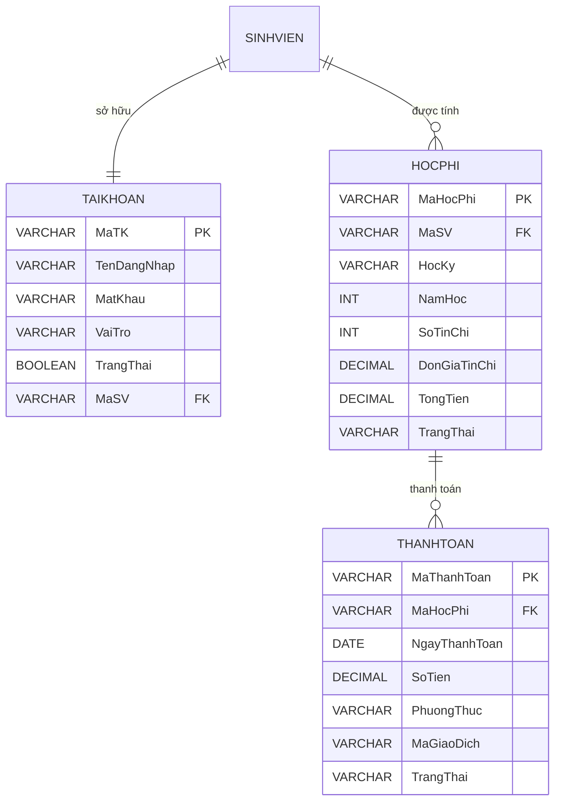

# Module 5 - Phân tích nghiệp vụ Học phí, Tài khoản & Vận hành

## 1. Giới thiệu

Module Học phí, Tài khoản và Vận hành là một thành phần quan trọng trong hệ thống đăng ký học phần. Module này giúp quản lý thông tin tài khoản người dùng, tính toán học phí dựa trên số tín chỉ đăng ký, theo dõi quá trình thanh toán và đảm bảo hệ thống hoạt động ổn định thông qua các chính sách sao lưu và khôi phục dữ liệu.

Đối tượng sử dụng gồm:

- Sinh viên
- Giảng viên
- Phòng Đào tạo

---

# 2. Phân tích nghiệp vụ Học phí

## 2.1 Mục tiêu

Cho phép hệ thống tự động tính học phí của sinh viên sau khi đăng ký học phần, đồng thời hỗ trợ theo dõi và quản lý quá trình thanh toán.

---

## 2.2 Đơn giá tín chỉ

Học phí được tính dựa trên tổng số tín chỉ sinh viên đăng ký trong học kỳ.

**Công thức:**

```
Học phí = Tổng số tín chỉ × Đơn giá tín chỉ
```

Ví dụ:

| Học phần | Số tín chỉ |
|----------|------------|
| Cơ sở dữ liệu | 3 |
| Công nghệ phần mềm | 4 |
| Mạng máy tính | 3 |

Tổng số tín chỉ: **10**

Đơn giá tín chỉ: **850.000 VNĐ**

Học phí:

```
10 × 850.000 = 8.500.000 VNĐ
```

---

## 2.3 Trạng thái học phí

- Chưa thanh toán
- Đang xử lý
- Đã thanh toán
- Quá hạn

---

# 3. Quy trình đóng học phí

```
Sinh viên
      │
      ▼
Đăng nhập hệ thống
      │
      ▼
Đăng ký học phần
      │
      ▼
Hệ thống tính tổng tín chỉ
      │
      ▼
Tính học phí
      │
      ▼
Hiển thị hóa đơn
      │
      ▼
Sinh viên thanh toán
      │
      ▼
Hệ thống xác nhận giao dịch
      │
      ▼
Cập nhật trạng thái
      │
      ▼
Hoàn thành
```

---

# 4. Phân tích nghiệp vụ Tài khoản

## 4.1 Mục tiêu

Quản lý tài khoản của người dùng trong hệ thống.

Mỗi người dùng có một tài khoản để đăng nhập và sử dụng các chức năng tương ứng với quyền hạn được cấp.

Thông tin tài khoản gồm:

- Mã tài khoản
- Tên đăng nhập
- Mật khẩu
- Vai trò
- Trạng thái

---

# 5. Phân quyền người dùng

## 5.1 Sinh viên

Chức năng:

- Đăng nhập
- Đổi mật khẩu
- Xem thông tin cá nhân
- Đăng ký học phần
- Xem học phí
- Thanh toán học phí
- Xem lịch sử thanh toán

---

## 5.2 Giảng viên

Chức năng:

- Đăng nhập
- Đổi mật khẩu
- Xem danh sách lớp
- Xem danh sách sinh viên
- Xem thời khóa biểu

---

## 5.3 Phòng Đào tạo

Chức năng:

- Quản lý sinh viên
- Quản lý lớp học
- Quản lý ngành
- Quản lý chương trình đào tạo
- Thiết lập đơn giá tín chỉ
- Quản lý học phí
- Xác nhận thanh toán
- Quản lý tài khoản
- Xuất báo cáo thống kê

---

# 6. Phân tích vận hành hệ thống

## 6.1 Ghi nhật ký hệ thống

Hệ thống ghi nhận các hoạt động:

- Đăng nhập
- Đăng xuất
- Đăng ký học phần
- Thanh toán học phí
- Thay đổi thông tin
- Cập nhật dữ liệu

Mục đích:

- Theo dõi hoạt động
- Kiểm tra lỗi
- Hỗ trợ khôi phục dữ liệu

---

## 6.2 Chính sách Backup

Để đảm bảo an toàn dữ liệu, hệ thống áp dụng chính sách sao lưu như sau:

- Sao lưu cơ sở dữ liệu tự động mỗi ngày.
- Thời gian sao lưu: 02:00 sáng.
- Lưu lại 07 bản sao lưu gần nhất.
- Dữ liệu sao lưu được lưu trên máy chủ dự phòng.
- Có khả năng khôi phục dữ liệu khi xảy ra sự cố.

---

## 6.3 Khôi phục dữ liệu

Khi hệ thống gặp sự cố:

1. Chọn bản sao lưu gần nhất.
2. Khôi phục cơ sở dữ liệu.
3. Kiểm tra tính toàn vẹn dữ liệu.
4. Đưa hệ thống trở lại trạng thái hoạt động.

---

# 7. Thiết kế cơ sở dữ liệu đề xuất

## Bảng TAIKHOAN

| Thuộc tính | Kiểu dữ liệu |
|------------|-------------|
| MaTK | PK |
| TenDangNhap | VARCHAR |
| MatKhau | VARCHAR |
| VaiTro | VARCHAR |
| TrangThai | BOOLEAN |
| MaSV | FK |

---

## Bảng HOCPHI

| Thuộc tính | Kiểu dữ liệu |
|------------|-------------|
| MaHocPhi | PK |
| MaSV | FK |
| HocKy | VARCHAR |
| NamHoc | INT |
| SoTinChi | INT |
| DonGiaTinChi | DECIMAL |
| TongTien | DECIMAL |
| TrangThai | VARCHAR |

---

## Bảng THANHTOAN

| Thuộc tính | Kiểu dữ liệu |
|------------|-------------|
| MaThanhToan | PK |
| MaHocPhi | FK |
| NgayThanhToan | DATE |
| SoTien | DECIMAL |
| PhuongThuc | VARCHAR |
| MaGiaoDich | VARCHAR |
| TrangThai | VARCHAR |

---

# 8. ERD mở rộng



---

# 9. Kết luận

Module Học phí, Tài khoản và Vận hành giúp tự động hóa quá trình quản lý học phí, phân quyền người dùng và đảm bảo an toàn dữ liệu của hệ thống. Việc xây dựng module này góp phần nâng cao hiệu quả quản lý, giảm sai sót trong quá trình thu học phí và tạo nền tảng để tích hợp các phương thức thanh toán trực tuyến trong tương lai.