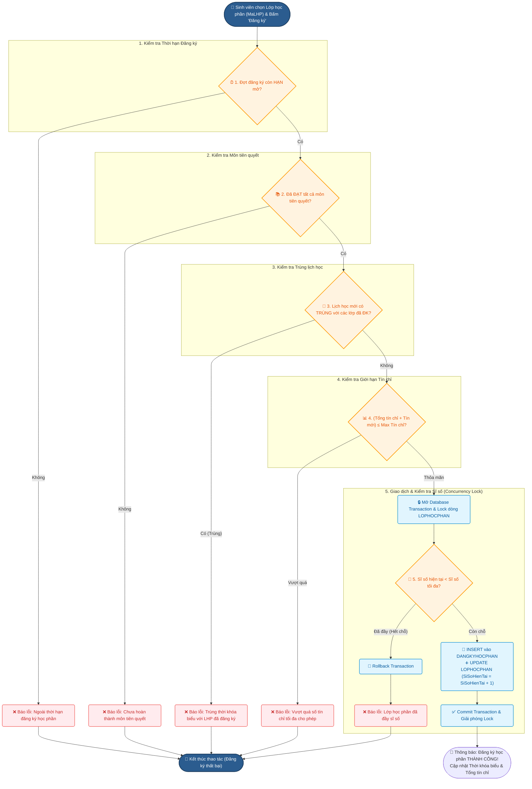

# ĐẶC TẢ NGHIỆP VỤ & PHÂN TÍCH 5 RÀNG BUỘC ĐĂNG KÝ HỌC PHẦN

> **Hệ thống:** Quản lý Đăng ký học phần Sinh viên  
> **Module:** Đăng ký học phần (Nghiệp vụ lõi)  
> **Tài liệu bàn giao:** `docs/analysis_dangky_hocphan.md`  

---

## I. TỔNG QUAN VỀ NGHIỆP VỤ ĐĂNG KÝ HỌC PHẦN

Module **Đăng ký học phần** là module nghiệp vụ trọng tâm của toàn bộ hệ thống quản lý đào tạo. Mặc dù dữ liệu lưu trữ trực tiếp chủ yếu xoay quanh bảng `DANGKYHOCPHAN`, nhưng đây là nơi gánh chịu tải lớn nhất và chứa toàn bộ logic xử lý ràng buộc toàn vẹn, đảm bảo tính nhất quán của dữ liệu khi sinh viên thao tác đồng thời.

Mục tiêu của quy trình đăng ký học phần là cho phép sinh viên đăng ký các lớp học phần mở trong học kỳ một cách hợp lệ, tuân thủ các quy chế đào tạo của Nhà trường, đồng thời ngăn chặn các lỗi phát sinh như đăng ký quá tải, trùng giờ học, chưa học môn tiên quyết hoặc đăng ký quá hạn.

---

## II. PHÂN TÍCH CHI TIẾT 5 RÀNG BUỘC ĐĂNG KÝ HỌC PHẦN

Hệ thống bắt buộc phải kiểm tra **5 ràng buộc chính** sau đây trước khi ghi nhận bất kỳ một giao dịch đăng ký học phần nào vào Database:

```
[Yêu cầu ĐK] ──► (1. Hạn ĐK) ──► (2. Tiên quyết) ──► (3. Trùng lịch) ──► (4. Max Tín chỉ) ──► (5. Sĩ số lớp) ──► [Thành công]
```

---

### 1. Ràng buộc 1: Hạn đăng ký (Registration Deadline Constraint)

#### a. Ý nghĩa nghiệp vụ
* Sinh viên chỉ được phép thực hiện các thao tác **Đăng ký mới**, **Thay đổi lớp**, hoặc **Hủy đăng ký** trong khoảng thời gian Đợt đăng ký đang ở trạng thái **MỞ (`MO`)**.
* Ngoài khoảng thời gian cấu hình (hoặc khi đợt đăng ký đã Khóa/Đóng), mọi thao tác từ phía sinh viên đều bị chặn.

#### b. Quy tắc kiểm tra (Rules & Logic)
* Cần truy xuất Đợt đăng ký active của học kỳ hiện tại dựa trên ngày giờ hệ thống (`NOW()` / `GETDATE()`).
* **Điều kiện hợp lệ:**
  $$\text{TuNgay} \le \text{ThoiGianHienTai} \le \text{DenNgay} \quad \text{AND} \quad \text{TrangThaiDot} = \text{'MO'}$$

#### c. Phân cấp xử lý & Tối ưu
* **Frontend:** Viết logic ẩn/disable nút "Đăng ký" / "Hủy" nếu đợt đăng ký đóng.
* **Backend / Database:** Kiểm tra lại lần cuối trong Stored Procedure đăng ký (`SP_DangKyHocPhan`). Nếu quá hạn, trả về mã lỗi `ERR_EXPIRED_REGISTRATION`.

#### d. Thông báo lỗi UI
> *"Rất tiếc! Hiện tại ngoài thời hạn đăng ký học phần của học kỳ này. Thao tác không thể thực hiện."*

---

### 2. Ràng buộc 2: Sĩ số tối đa của Lớp học phần (Class Capacity Constraint)

#### a. Ý nghĩa nghiệp vụ
* Mỗi lớp học phần được quy định một sĩ số tối đa (`SiSoToiDa`) dựa trên sức chứa của phòng học hoặc định mức của bộ môn/khoa.
* Số lượng sinh viên thực tế đã đăng ký thành công (`SiSoHienTai`) không bao giờ được vượt quá `SiSoToiDa`.

#### b. Quy tắc kiểm tra (Rules & Logic)
* **Điều kiện hợp lệ:**
  $$\text{SiSoHienTai} < \text{SiSoToiDa}$$

#### c. Xử lý tranh chấp đồng thời (Concurrency & Lost Update Risk)
* **Vấn đề:** Khi lớp học phần chỉ còn **01 chỗ trống cuối cùng**, nếu 2 sinh viên (SV A và SV B) cùng bấm nút "Xác nhận đăng ký" tại cùng một thời điểm millisecond:
  * Nếu dùng câu lệnh `SELECT` thông thường, cả 2 phiên đăng ký đều đọc được `SiSoHienTai = 39` (< `SiSoToiDa = 40`).
  * Cả 2 đều ghi nhận thành công làm `SiSoHienTai` vọt lên `41` (Vượt quá sĩ số).
* **Giải pháp kiến trúc:**
  * Sử dụng **Transaction** kết hợp với **Lock độc quyền (Exclusive Lock / Pessimistic Locking)** hoặc câu lệnh `UPDATE` có điều kiện nguyên tử:
    ```sql
    UPDATE LOPHOCPHAN 
    SET SiSoHienTai = SiSoHienTai + 1 
    WHERE MaLHP = @MaLHP AND SiSoHienTai < SiSoToiDa;
    ```
  * Nếu `@@ROWCOUNT = 0`, báo lỗi lớp đã đầy.

#### d. Thông báo lỗi UI
> *"Đăng ký thất bại! Lớp học phần [Mã LHP] đã đầy sĩ số (Hết chỗ trống)."*

---

### 3. Ràng buộc 3: Môn học tiên quyết (Prerequisite Course Constraint)

#### a. Ý nghĩa nghiệp vụ
* Nhằm đảm bảo lộ trình kiến thức, sinh viên bắt buộc phải học và thi đạt môn học tiên quyết (Môn A) trước khi được phép đăng ký môn học nối tiếp (Môn B).
* Ví dụ: Phải qua môn *Lập trình C/C++* mới được đăng ký môn *Cấu trúc dữ liệu và giải thuật*.

#### b. Quy tắc kiểm tra (Rules & Logic)
* Lấy danh sách các môn tiên quyết của Môn học thuộc LHP đăng ký từ bảng `MONTIENQUYET`.
* Kiểm tra lịch sử học tập của Sinh viên trong bảng `KETQUAHOCTAP`:
* **Điều kiện hợp lệ:**
  $$\forall m \in \text{DanhSachMonTienQuyet}(Mab): \exists \text{KetQua}(SV, m) \quad \text{sao cho} \quad \text{DiemHe4} \ge 1.0 \quad (\text{hoặc DiemChu} \ne 'F')$$

#### c. Phân cấp xử lý
* Sử dụng `EXISTS` / `NOT EXISTS` hoặc Subquery trong Database Function `FN_KiemTraTienQuyet(MaSV, MaMonHoc)`.

#### d. Thông báo lỗi UI
> *"Không thể đăng ký! Bạn chưa hoàn thành môn học tiên quyết: [Mã môn A - Tên môn A]."*

---

### 4. Ràng buộc 4: Trùng lịch học & Trùng lịch thi (Schedule Conflict Constraint)

#### a. Ý nghĩa nghiệp vụ
* Sinh viên không thể có mặt ở 2 nơi cùng một lúc. Do đó, Lớp học phần mới đăng ký không được trùng thời khóa biểu (Thứ, Tiết bắt đầu, Số tiết) với bất kỳ Lớp học phần nào khác sinh viên **đã đăng ký thành công** trong cùng học kỳ.
* (Mở rộng): Trùng lịch thi kết thúc học phần cũng không được phép.

#### b. Quy tắc kiểm tra (Rules & Logic)
* Hai thời khóa biểu được coi là **TRÙNG LỊCH** nếu:
  1. Cùng **Thứ trong tuần** ($\text{Thu}_1 = \text{Thu}_2$).
  2. Cùng **Khoảng tuần học** có điểm chung (giao nhau giữa các tuần học).
  3. **Khoảng tiết học giao nhau**:
     $$[\text{TietBD}_1, \text{TietBD}_1 + \text{SoTiet}_1 - 1] \quad \cap \quad [\text{TietBD}_2, \text{TietBD}_2 + \text{SoTiet}_2 - 1] \ne \emptyset$$
* Công thức kiểm tra 2 khoảng tiết $[A, B]$ và $[C, D]$ bị trùng:
  $$\text{Trùng khi: } \max(A, C) \le \min(B, D)$$

#### c. Phân cấp xử lý
* **Database Function:** `FN_KiemTraTrungLichHoc(MaSV, MaLHP_Moi)` quét qua bảng tạm / bảng `DANGKYHOCPHAN` JOIN `LICHHOC` của các lớp đã đăng ký.

#### d. Thông báo lỗi UI
> *"Đăng ký thất bại! Lớp học phần [Mã LHP mới] bị trùng lịch học với lớp [Mã LHP cũ - Tên môn] (Thứ X, Tiết Y - Z)."*

---

### 5. Ràng buộc 5: Giới hạn Tín chỉ Min - Max theo Quy chế (Credit Limit Constraint)

#### a. Ý nghĩa nghiệp vụ
* Đảm bảo khối lượng học tập phù hợp với năng lực sinh viên và quy chế đào tạo theo tín chỉ:
  * **Min Tín chỉ:** Số tín chỉ tối thiểu sinh viên phải đăng ký để duy trì trạng thái sinh viên chính quy trong học kỳ (tránh đăng ký quá ít).
  * **Max Tín chỉ:** Số tín chỉ tối đa sinh viên được phép đăng ký trong một học kỳ (tránh quá tải).
* Ngưỡng Min/Max có thể thay đổi linh hoạt tùy theo xếp loại học lực của sinh viên (Ví dụ: SV Cảnh báo học vụ chỉ được ĐK tối đa 14 tín chỉ; SV Xuất sắc được ĐK tối đa 28 tín chỉ).

#### b. Quy tắc kiểm tra (Rules & Logic)
* **Tổng tín chỉ dự kiến:**
  $$\text{TongTinChiMoi} = \text{TongTinChiDaDangKy} + \text{SoTinChi}(LHP_{Moi})$$
* **Điều kiện hợp lệ khi bấm thêm lớp:**
  $$\text{TongTinChiMoi} \le \text{MaxTinChi}$$
* **Điều kiện hợp lệ khi Chốt đơn / Kết thúc đợt ĐK:**
  $$\text{MinTinChi} \le \text{TongTinChiDaDangKy} \le \text{MaxTinChi}$$

#### c. Phân cấp xử lý
* Cho phép sinh viên đưa lớp vào "Giỏ đăng ký" tạm thời.
* Khi bấm "Xác nhận Đăng ký", kiểm tra `TongTinChiMoi <= MaxTinChi`.
* Cảnh báo nếu `TongTinChi < MinTinChi` khi đợt đăng ký sắp đóng.

#### d. Thông báo lỗi UI
> *"Không thể đăng ký! Tổng số tín chỉ sau khi thêm ([X] TC) vượt quá giới hạn tối đa cho phép ([Max] TC) trong học kỳ này."*

---

## III. BẢNG TỔNG HỢP 5 RÀNG BUỘC

| STT | Ràng buộc | Mã lỗi | Điều kiện kiểm tra SQL/Logic | Thời điểm kiểm tra | Mức xử lý chính |
|---|---|---|---|---|---|
| **1** | **Hạn đăng ký** | `ERR_EXPIRED` | `NOW() BETWEEN TuNgay AND DenNgay AND TrangThai = 'MO'` | Ngay khi truy cập / Bấm ĐK | Application + SP |
| **2** | **Môn tiên quyết** | `ERR_PREREQ` | `NOT EXISTS (Môn TQ chưa qua)` trong `KETQUAHOCTAP` | Bấm chọn LHP | Database Function / SP |
| **3** | **Trùng lịch học** | `ERR_SCHEDULE` | $\max(\text{TietBD}_1, \text{TietBD}_2) \le \min(\text{TietKT}_1, \text{TietKT}_2)$ trên cùng Thứ | Bấm chọn LHP | Database Function / SP |
| **4** | **Min - Max Tín chỉ** | `ERR_CREDIT` | $\text{TongTinChi} + \text{STC}_{\text{mới}} \le \text{MaxTinChi}$ | Bấm chọn LHP | Backend Logic / SP |
| **5** | **Sĩ số lớp** | `ERR_CAPACITY` | $\text{SiSoHienTai} < \text{SiSoToiDa}$ (Lock dòng) | Thao tác ghi nhận Transaction | Database SP (Transaction) |

---

## IV. LƯU ĐỒ XỬ LÝ (FLOWCHART) TOÀN BỘ QUY TRÌNH ĐĂNG KÝ HỌC PHẦN

Lưu đồ dưới đây thể hiện tuần tự các bước xử lý từ khi Sinh viên gửi yêu cầu đăng ký 1 Lớp học phần cho đến khi ghi nhận thành công vào CSDL.



---

## V. MA TRẬN XỬ LÝ VÀ PHÂN CÔNG THỰC THI (IMPLEMENTATION MATRIX)

| Ràng buộc | Kiểm tra tại Frontend (UI/UX) | Kiểm tra tại Backend (API Service) | Thực thi tại Database (Stored Procedure) |
|---|---|---|---|
| **1. Hạn ĐK** | Disable button ĐK khi hết hạn | Check `DotDangKy` status | Verify `GETDATE()` vs `TuNgay/DenNgay` |
| **2. Tiên quyết** | Show badge "Chưa học môn TQ" | Call Prereq validation API | Exec `FN_KiemTraTienQuyet()` |
| **3. Trùng lịch** | Highlight đỏ ca học bị trùng trên TKB | Scan overlaps in memory/cache | Exec `FN_KiemTraTrungLichHoc()` |
| **4. Min-Max TC** | Realtime credit counter counter (X / 24 TC) | Validate student max credit tier | Calculate total credits check |
| **5. Sĩ số** | Display current capacity (e.g. 39/40) | Catch concurrent registration errors | Lock row `UPDATE ... WHERE SiSoHienTai < SiSoToiDa` |

---

## VI. KẾT LUẬN

Việc phân tích chi tiết **5 ràng buộc đăng ký** và xây dựng **Lưu đồ xử lý (Flowchart)** chặt chẽ giúp:
1. Đảm bảo toàn bộ quy trình đăng ký diễn ra minh bạch, đúng quy chế đào tạo.
2. Ngăn ngừa triệt để các lỗi bất biến dữ liệu, đặc biệt là sự cố **Race Condition / Lost Update** khi có hàng nghìn sinh viên truy cập đăng ký đồng thời.
3. Làm cơ sở trực tiếp để viết Stored Procedure `DangKyHocPhan`, các Database Functions, Triggers, cũng như thiết kế giao diện UI/UX thông báo lỗi thân thiện cho sinh viên.
