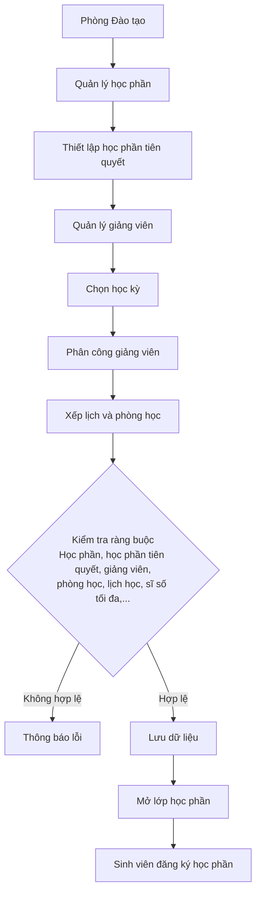

# Phân tích nghiệp vụ Học phần, Giảng viên & Mở lớp học phần
## 1. Giới thiệu nghiệp vụ
### 1.1 Mô tả nghiệp vụ

Module Học phần, Giảng viên và Mở lớp học phần là một trong những nghiệp vụ cốt lõi của hệ thống quản lý đăng ký tín chỉ. Module này hỗ trợ Phòng Đào tạo quản lý danh mục học phần, thiết lập học phần tiên quyết, quản lý thông tin giảng viên và tổ chức mở các lớp học phần theo từng học kỳ. Đồng thời, hệ thống hỗ trợ phân công giảng viên, sắp xếp lịch học và phòng học nhằm đảm bảo việc tổ chức giảng dạy diễn ra hiệu quả và không xảy ra xung đột.

Sau khi các lớp học phần được tạo thành công và đáp ứng đầy đủ các điều kiện về học phần, học phần tiên quyết, giảng viên, lịch học và phòng học, dữ liệu sẽ được công bố để sinh viên thực hiện đăng ký học phần. Vì vậy, tính chính xác và nhất quán của dữ liệu trong module này ảnh hưởng trực tiếp đến toàn bộ quá trình đăng ký và quản lý học tập của sinh viên.

### 1.2 Mục tiêu nghiệp vụ

•	Quản lý danh mục học phần của nhà trường.

•	Thiết lập và quản lý học phần tiên quyết.

•	Quản lý thông tin giảng viên.

•	Quản lý việc mở lớp học phần theo từng học kỳ.

•	Phân công giảng viên giảng dạy.

•	Xây dựng lịch học và bố trí phòng học.

•	Kiểm tra các ràng buộc khi mở lớp học phần (trùng lịch giảng viên, trùng phòng học, điều kiện tiên quyết,...).

•	Chuẩn bị dữ liệu phục vụ sinh viên đăng ký học phần.

## 2. Tác nhân

| Tác nhân | Vai trò |
| :--- | :--- |
| Phòng Đào tạo | Quản lý học phần, giảng viên và mở lớp học phần |
| Giảng viên | Được phân công giảng dạy các lớp học phần |
| Sinh viên | Xem danh sách lớp học phần để đăng ký |

## 3. Use Case

| STT | Use Case | Tác nhân | Mô tả |
| :---: | :--- | :--- | :--- |
| 1 | Quản lý học phần | Phòng Đào tạo | Thêm, sửa, xóa và tra cứu thông tin học phần. |
| 2 | Quản lý học phần tiên quyết | Phòng Đào tạo | Thiết lập, cập nhật hoặc xóa quan hệ tiên quyết giữa các học phần. |
| 3 | Quản lý giảng viên | Phòng Đào tạo | Thêm, sửa, xóa và cập nhật thông tin giảng viên. |
| 4 | Chọn học kỳ | Phòng Đào tạo | Chọn học kỳ để thực hiện mở lớp học phần. |
| 5 | Mở lớp học phần | Phòng Đào tạo | Tạo lớp học phần cho học phần đã chọn. |
| 6 | Phân công giảng viên | Phòng Đào tạo | Phân công giảng viên phụ trách giảng dạy lớp học phần. |
| 7 | Xếp lịch và phòng học | Phòng Đào tạo | Thiết lập lịch học, phòng học và sĩ số tối đa cho lớp học phần. |
| 8 | Xem lớp học phần được phân công | Giảng viên | Xem danh sách các lớp học phần được phân công giảng dạy. |
| 9 | Xem danh sách lớp học phần | Sinh viên | Xem danh sách các lớp học phần đã được mở để đăng ký. |

## 4.Phân tích nghiệp vụ
### 4.1. Phân tích nghiệp vụ quản lý học phần
Mô tả

Phòng Đào tạo chịu trách nhiệm xây dựng và quản lý danh mục học phần của nhà trường. Mỗi học phần được xác định bằng một mã học phần duy nhất và chứa các thông tin như tên học phần, số tín chỉ, số tiết lý thuyết, số tiết thực hành và học phần tiên quyết (nếu có).

Đối với những học phần có yêu cầu tiên quyết, Phòng Đào tạo sẽ thiết lập mối quan hệ giữa học phần hiện tại và học phần tiên quyết tương ứng nhằm đảm bảo sinh viên chỉ được đăng ký khi đã hoàn thành các học phần theo quy định.

Danh mục học phần là cơ sở để xây dựng chương trình đào tạo và mở lớp học phần trong từng học kỳ.
Dữ liệu đầu vào

•	Mã học phần

•	Tên học phần

•	Số tín chỉ

•	Số tiết lý thuyết

•	Số tiết thực hành

•	Học phần tiên quyết (nếu có)

Dữ liệu đầu ra

•	Danh sách học phần

•	Thông tin học phần đã được lưu

•	Danh sách quan hệ học phần tiên quyết

Quy tắc nghiệp vụ

•	Mã học phần phải duy nhất.

•	Tên học phần không được để trống.

•	Số tín chỉ phải lớn hơn 0.

•	Không được xóa học phần đang được mở lớp.

•	Học phần tiên quyết (nếu có) phải tồn tại trong hệ thống.

•	Một học phần không được thiết lập làm học phần tiên quyết của chính nó.

### 4.2. Phân tích nghiệp vụ quản lý giảng viên
Mô tả
Phòng Đào tạo quản lý hồ sơ giảng viên nhằm phục vụ việc phân công giảng dạy cho các lớp học phần. Mỗi giảng viên được xác định bằng một mã giảng viên duy nhất và có các thông tin như họ tên, email, số điện thoại, khoa và chức vụ.

Thông tin giảng viên là cơ sở để phân công giảng dạy, xây dựng thời khóa biểu và quản lý các lớp học phần trong từng học kỳ.

Dữ liệu đầu vào

•	Mã giảng viên

•	Họ tên

•	Email

•	Số điện thoại

•	Mã khoa

•	Chức vụ

Dữ liệu đầu ra

•	Danh sách giảng viên

•	Hồ sơ giảng viên

Quy tắc nghiệp vụ

•	Mã giảng viên phải duy nhất.

•	Email phải đúng định dạng.

•	Không được xóa giảng viên đang được phân công giảng dạy.

•	Một giảng viên không được phân công giảng dạy hai lớp học phần có lịch học trùng nhau.

### 4.3. Phân tích nghiệp vụ mở lớp học phần
Mô tả

Sau khi danh mục học phần, học phần tiên quyết và danh sách giảng viên đã được thiết lập, Phòng Đào tạo tiến hành mở các lớp học phần theo từng học kỳ.

Mỗi lớp học phần được gắn với một học phần, một học kỳ, một giảng viên phụ trách, một phòng học, một lịch học và quy định sĩ số tối đa. Trước khi lưu vào hệ thống, hệ thống sẽ kiểm tra các điều kiện như tính hợp lệ của học phần, giảng viên, lịch học, phòng học và các ràng buộc liên quan để đảm bảo không xảy ra xung đột. Sau khi được tạo thành công, lớp học phần sẽ được công bố để sinh viên đăng ký.

Dữ liệu đầu vào

•	Học phần

•	Học kỳ

•	Giảng viên

•	Phòng học

•	Lịch học

•	Sĩ số tối đa

Dữ liệu đầu ra

•	Danh sách lớp học phần

•	Lịch học

•	Danh sách phân công giảng viên

Quy tắc nghiệp vụ

•	Học phần phải tồn tại trong hệ thống.

•	Giảng viên phải tồn tại trong hệ thống.

•	Học kỳ phải tồn tại trong hệ thống.

•	Không được trùng lịch giảng viên.

•	Không được trùng phòng học.

•	Sĩ số tối đa phải lớn hơn 0.

•	Học phần có thể có hoặc không có học phần tiên quyết.

•	Nếu học phần có học phần tiên quyết thì học phần tiên quyết phải tồn tại trong hệ thống.

•	Khi đủ sĩ số tối đa, lớp học phần sẽ đóng đăng ký.

## 5. Luồng xử lý nghiệp vụ

    
## 6. Phân tích dữ liệu
Module sử dụng các thực thể chính:

•	HOCPHAN: Lưu thông tin học phần. 

•	HOCPHAN_TIENQUYET: Lưu quan hệ tiên quyết giữa các học phần. 

•	GIANGVIEN: Lưu thông tin giảng viên. 

•	HOCKY: Lưu thông tin học kỳ. 

•	PHONGHOC: Lưu thông tin phòng học. 

•	LICHHOC: Lưu thông tin lịch học của lớp học phần. 

•	LOPHOCPHAN: Lưu thông tin các lớp học phần được mở.
