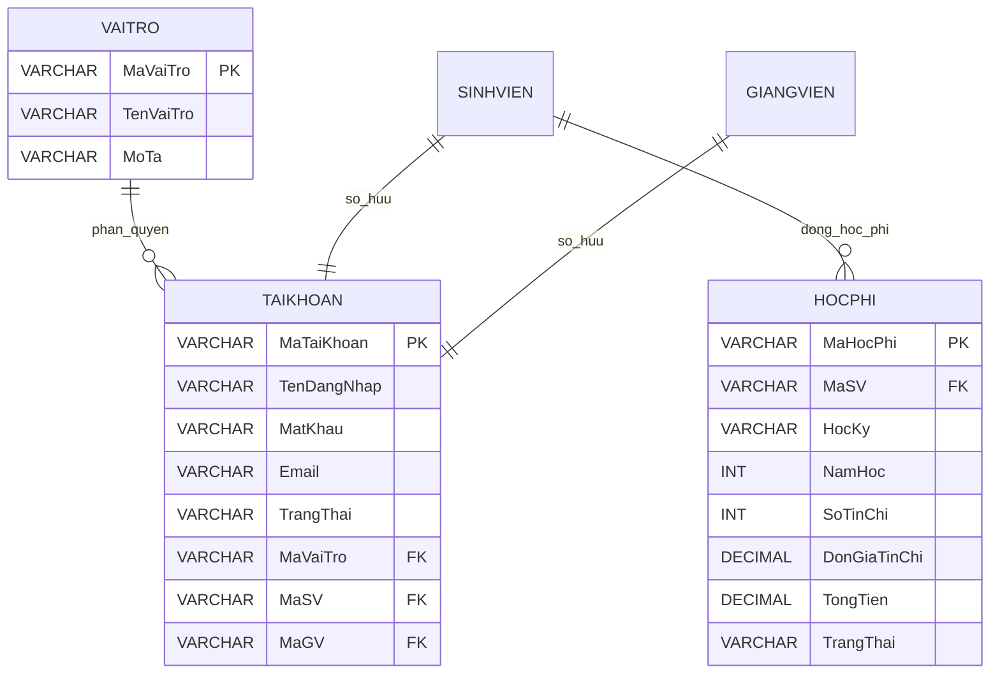

# Thiết kế ERD Học phí, Tài khoản & Vận hành

## Mục tiêu

Thiết kế cơ sở dữ liệu cho module **Học phí, Tài khoản và Vai trò** nhằm hỗ trợ quản lý học phí, tài khoản đăng nhập và phân quyền người dùng trong hệ thống đăng ký học phần.

Các bảng được thiết kế gồm:

- HOCPHI
- TAIKHOAN
- VAITRO

---

## Bảng VAITRO

| Thuộc tính | Kiểu dữ liệu | Ràng buộc | Mô tả |
|------------|--------------|-----------|-------|
| MaVaiTro | VARCHAR | PK | Mã vai trò |
| TenVaiTro | VARCHAR | | Tên vai trò (Student, Lecturer, AcademicOffice) |
| MoTa | VARCHAR | | Mô tả vai trò |

---

## Bảng TAIKHOAN

| Thuộc tính | Kiểu dữ liệu | Ràng buộc | Mô tả |
|------------|--------------|-----------|-------|
| MaTaiKhoan | VARCHAR | PK | Mã tài khoản |
| TenDangNhap | VARCHAR | UNIQUE | Tên đăng nhập |
| MatKhau | VARCHAR | | Mật khẩu đã mã hóa |
| Email | VARCHAR | | Email |
| TrangThai | VARCHAR | | Active / Locked |
| MaVaiTro | VARCHAR | FK | Tham chiếu bảng VAITRO |
| MaSV | VARCHAR | FK | Tham chiếu bảng SINHVIEN (nếu là sinh viên) |
| MaGV | VARCHAR | FK | Tham chiếu bảng GIANGVIEN (nếu là giảng viên) |

---

## Bảng HOCPHI

| Thuộc tính | Kiểu dữ liệu | Ràng buộc | Mô tả |
|------------|--------------|-----------|-------|
| MaHocPhi | VARCHAR | PK | Mã học phí |
| MaSV | VARCHAR | FK | Sinh viên đóng học phí |
| HocKy | VARCHAR | | Học kỳ |
| NamHoc | INT | | Năm học |
| SoTinChi | INT | | Tổng số tín chỉ |
| DonGiaTinChi | DECIMAL | | Đơn giá mỗi tín chỉ |
| TongTien | DECIMAL | | Tổng học phí |
| TrangThai | VARCHAR | | Chưa thanh toán / Đã thanh toán |

---

## Quan hệ giữa các bảng

- Một **vai trò** có thể được gán cho nhiều **tài khoản**.
- Mỗi **tài khoản** thuộc một **vai trò**.
- Mỗi **sinh viên** có một tài khoản đăng nhập và có thể có nhiều bản ghi học phí theo từng học kỳ.
- Mỗi **giảng viên** có một tài khoản đăng nhập.

---

## ERD

---

## Kết luận

Thiết kế ERD trên giúp tổ chức dữ liệu của module Học phí, Tài khoản và Vai trò một cách hợp lý. Các bảng được liên kết thông qua khóa chính và khóa ngoại, hỗ trợ quản lý tài khoản người dùng, phân quyền truy cập và theo dõi học phí của sinh viên theo từng học kỳ.