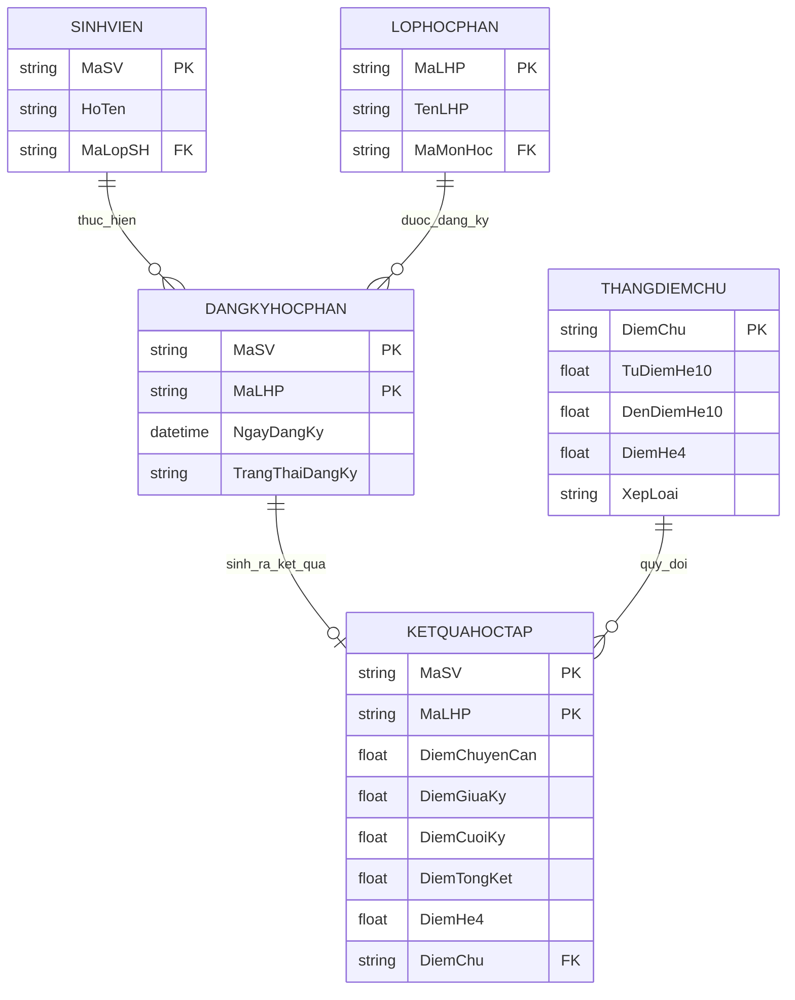

# THIẾT KẾ ERD MODULE ĐIỂM SỐ & KẾT QUẢ HỌC TẬP

> **Hệ thống:** Quản lý Đăng ký học phần Sinh viên  
> **Module:** Module 4 — Điểm số & Kết quả học tập (Thành viên 4)  
> **Bảng phụ trách chính:** `KETQUAHOCTAP`, `THANGDIEMCHU`  
> **Tài liệu bàn giao:** `docs/erd_diem_ketqua.md`  
> **Issue GitHub:** #8 (Thiết kế ERD Điểm số & Kết quả học tập)

---

## I. TỔNG QUAN VỀ THIẾT KẾ ERD MODULE 4

Module Điểm số & Kết quả học tập bao gồm **2 bảng dữ liệu chính**:
1. **`KETQUAHOCTAP`**: Lưu trữ toàn bộ điểm số thành phần, điểm tổng kết, điểm hệ 4 và điểm chữ của từng sinh viên theo từng lớp học phần đã đăng ký.
2. **`THANGDIEMCHU`**: Bảng tra cứu danh mục dùng để quy đổi điểm hệ 10 sang thang điểm chữ và điểm hệ 4 (tránh việc hard-code ngưỡng điểm trong câu lệnh SQL hoặc mã nguồn ứng dụng).

### Mối liên kết với Module 3 (TV3 — Đăng ký học phần)
Bảng `KETQUAHOCTAP` tham chiếu trực tiếp đến bảng trung tâm **`DANGKYHOCPHAN`** thông qua **Khóa ngoại ghép (Composite Foreign Key)** gồm 2 cột `(MaSV, MaLHP)`. Điều này bảo đảm tính nhất quán dữ liệu tuyệt đối: **chỉ những sinh viên đã đăng ký học phần thành công mới có thể có bản ghi điểm học tập.**

```
┌────────────────────────────────────────────────────────┐
│                    DANGKYHOCPHAN                       │ (Module 3 — TV3)
│  - PK ghép: (MaSV, MaLHP)                              │
└──────────────────────────┬─────────────────────────────┘
                           │ (1 : 0..1)
                           ▼
┌────────────────────────────────────────────────────────┐
│                     KETQUAHOCTAP                       │ (Module 4 — TV4)
│  - PK ghép: (MaSV, MaLHP)                              │
│  - FK ghép: (MaSV, MaLHP) ──► DANGKYHOCPHAN            │
│  - FK: DiemChu ─────────────► THANGDIEMCHU(DiemChu)    │
└──────────────────────────▲─────────────────────────────┘
                           │ (N : 1)
┌──────────────────────────┴─────────────────────────────┐
│                     THANGDIEMCHU                       │ (Module 4 — Tra cứu)
│  - PK: DiemChu                                         │
└────────────────────────────────────────────────────────┘
```

---

## II. SƠ ĐỒ ERD CHI TIẾT MODULE 4 (MERMAID ER DIAGRAM)

Sơ đồ thể hiện cấu trúc 2 bảng thuộc Module 4 cùng mối quan hệ tham chiếu với các bảng liên quan trong hệ thống (`SINHVIEN`, `LOPHOCPHAN`, `DANGKYHOCPHAN`):



---

## III. ĐẶC TẢ CHI TIẾT THUỘC TÍNH CÁC BẢNG

### 1. Bảng `KETQUAHOCTAP` (Bản ghi điểm sinh viên theo lớp học phần)

| Tên Cột | Kiểu Dữ Liệu | Ràng Buộc (Constraints) | Mô Tả Nghiệp Vụ |
|---|---|---|---|
| `MaSV` | `VARCHAR(10)` | **PK, FK** $\rightarrow$ `DANGKYHOCPHAN(MaSV)` | Mã sinh viên |
| `MaLHP` | `VARCHAR(15)` | **PK, FK** $\rightarrow$ `DANGKYHOCPHAN(MaLHP)` | Mã lớp học phần |
| `DiemChuyenCan` | `FLOAT` | **NULL**, `CHECK(0.0 <= x <= 10.0)` | Điểm chuyên cần (trọng số 10%) |
| `DiemGiuaKy` | `FLOAT` | **NULL**, `CHECK(0.0 <= x <= 10.0)` | Điểm kiểm tra giữa kỳ (trọng số 30%) |
| `DiemCuoiKy` | `FLOAT` | **NULL**, `CHECK(0.0 <= x <= 10.0)` | Điểm thi kết thúc học phần (trọng số 60%) |
| `DiemTongKet` | `FLOAT` | **NULL**, `CHECK(0.0 <= x <= 10.0)` | Điểm tổng kết hệ 10 (tự động tính) |
| `DiemHe4` | `FLOAT` | **NULL**, `CHECK(0.0 <= x <= 4.0)` | Điểm tổng kết quy đổi hệ 4 |
| `DiemChu` | `VARCHAR(2)` | **FK** $\rightarrow$ `THANGDIEMCHU(DiemChu)` | Thang điểm chữ (A, B+, B, C+, C, D+, D, F) |

* **Khóa chính (PK):** Composite PK `(MaSV, MaLHP)`. Mỗi sinh viên chỉ có duy nhất 1 bản ghi điểm trong 1 lớp học phần.
* **Khóa ngoại (FK 1):** Composite FK `(MaSV, MaLHP)` tham chiếu đến `DANGKYHOCPHAN(MaSV, MaLHP)` với điều kiện `ON DELETE CASCADE / NO ACTION`.
* **Khóa ngoại (FK 2):** `DiemChu` tham chiếu đến `THANGDIEMCHU(DiemChu)`.

### 2. Bảng `THANGDIEMCHU` (Danh mục tra cứu quy đổi thang điểm)

| Tên Cột | Kiểu Dữ Liệu | Ràng Buộc (Constraints) | Mô Tả Nghiệp Vụ |
|---|---|---|---|
| `DiemChu` | `VARCHAR(2)` | **PK**, `NOT NULL` | Ký hiệu điểm chữ ('A', 'B+', 'B', 'C+', 'C', 'D+', 'D', 'F') |
| `TuDiemHe10` | `FLOAT` | **NOT NULL**, `CHECK(0.0 <= x <= 10.0)` | Cận dưới khoảng điểm hệ 10 |
| `DenDiemHe10` | `FLOAT` | **NOT NULL**, `CHECK(0.0 <= x <= 10.0)` | Cận trên khoảng điểm hệ 10 |
| `DiemHe4` | `FLOAT` | **NOT NULL**, `CHECK(0.0 <= x <= 4.0)` | Điểm quy đổi hệ 4 tương ứng |
| `XepLoai` | `NVARCHAR(20)` | **NOT NULL** | Nhãn xếp loại (Xuất sắc, Khá, Trung bình, Kém...) |

---

## IV. MA TRẬN KHÓA NGOẠI & THỐNG NHẤT KHÓA VỚI MODULE 3 (TV3)

Đảm bảo sự khớp nối 100% giữa thiết kế của **Thành viên 4 (Điểm số)** và **Thành viên 3 (Đăng ký học phần)**:

```
[DANGKYHOCPHAN]                                [KETQUAHOCTAP]
┌────────────────────────┐                    ┌────────────────────────┐
│ MaSV (PK, FK)          │ ◄───────────────── │ MaSV (PK, FK ghép)     │
│ MaLHP (PK, FK)         │ ◄───────────────── │ MaLHP (PK, FK ghép)    │
│ NgayDangKy             │                    │ DiemChuyenCan          │
│ TrangThaiDangKy        │                    │ DiemGiuaKy             │
└────────────────────────┘                    │ DiemCuoiKy             │
                                              │ DiemTongKet            │
                                              │ DiemHe4                │
                                              │ DiemChu (FK)           │
                                              └────────────────────────┘
```

---

## V. ĐỀ XUẤT SQL CONSTRAINT DECLARATION (DỰ THẢO DDL)

```sql
-- 1. Bảng Tra cứu Thang điểm chữ
CREATE TABLE THANGDIEMCHU (
    DiemChu VARCHAR(2) NOT NULL,
    TuDiemHe10 FLOAT NOT NULL,
    DenDiemHe10 FLOAT NOT NULL,
    DiemHe4 FLOAT NOT NULL,
    XepLoai NVARCHAR(20) NOT NULL,
    CONSTRAINT PK_THANGDIEMCHU PRIMARY KEY (DiemChu),
    CONSTRAINT CK_TuDiem CHECK (TuDiemHe10 >= 0.0 AND TuDiemHe10 <= 10.0),
    CONSTRAINT CK_DenDiem CHECK (DenDiemHe10 >= 0.0 AND DenDiemHe10 <= 10.0),
    CONSTRAINT CK_DiemHe4 CHECK (DiemHe4 >= 0.0 AND DiemHe4 <= 4.0)
);

-- 2. Bảng Kết quả học tập
CREATE TABLE KETQUAHOCTAP (
    MaSV VARCHAR(10) NOT NULL,
    MaLHP VARCHAR(15) NOT NULL,
    DiemChuyenCan FLOAT NULL,
    DiemGiuaKy FLOAT NULL,
    DiemCuoiKy FLOAT NULL,
    DiemTongKet FLOAT NULL,
    DiemHe4 FLOAT NULL,
    DiemChu VARCHAR(2) NULL,
    CONSTRAINT PK_KETQUAHOCTAP PRIMARY KEY (MaSV, MaLHP),
    CONSTRAINT FK_KQHT_DANGKY Foreign Key (MaSV, MaLHP) REFERENCES DANGKYHOCPHAN(MaSV, MaLHP),
    CONSTRAINT FK_KQHT_THANGDIEM FOREIGN KEY (DiemChu) REFERENCES THANGDIEMCHU(DiemChu),
    CONSTRAINT CK_DiemCC CHECK (DiemChuyenCan IS NULL OR (DiemChuyenCan >= 0.0 AND DiemChuyenCan <= 10.0)),
    CONSTRAINT CK_DiemGK CHECK (DiemGiuaKy IS NULL OR (DiemGiuaKy >= 0.0 AND DiemGiuaKy <= 10.0)),
    CONSTRAINT CK_DiemCK CHECK (DiemCuoiKy IS NULL OR (DiemCuoiKy >= 0.0 AND DiemCuoiKy <= 10.0)),
    CONSTRAINT CK_DiemTK CHECK (DiemTongKet IS NULL OR (DiemTongKet >= 0.0 AND DiemTongKet <= 10.0))
);
```
